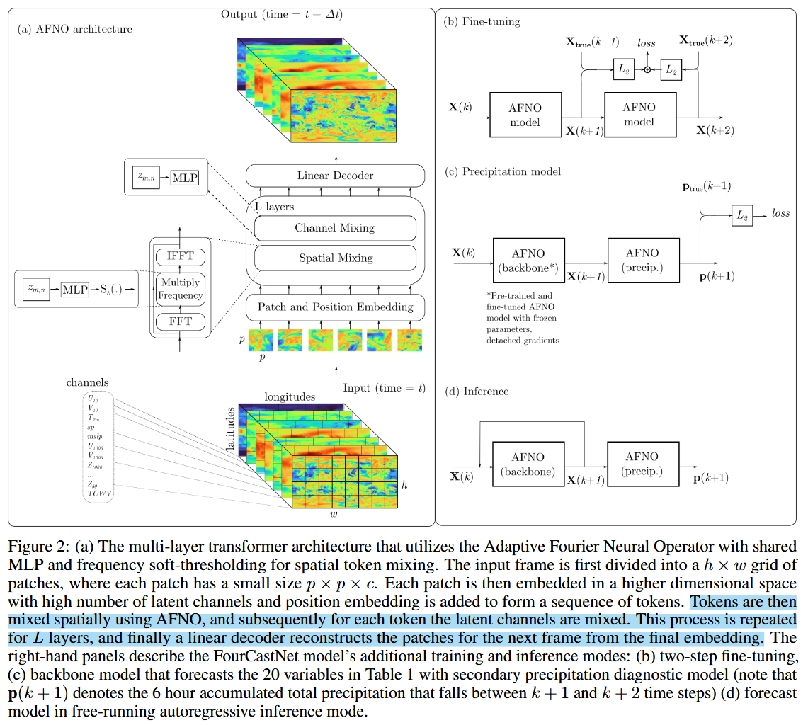
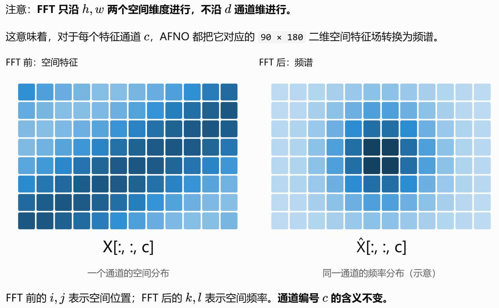

## FourCastNet量化指标

* 分辨率0.25°，全球网格数720×1440
* 速度，比单节点传统NWP快45,000倍
* 20 个变量 + 降水诊断
* 提前96h预报台风山竹，预测3天的精度与NWP相当，预测1周略逊于NWP

## 模型结构

**FourCastNet = AFNO + ViT**

* AFNO: resolution-invariant 适应分辨率不变性
* ViT backbone: long-range dependencies 长距离依赖，vision Transformer (ViT)

### 数据流

```
输入帧 X(k)：720×1440×12
  ↓ patchify（8×8×c），每 patch → d=8×8×c 维 token，→ h×w patches
  ↓ + position embedding
  input tensors of patches X∈R^{h×w×d}，h=90, w=180, d=768
  	↓ L 层 AFNO block，每层 = 空间混合FFT → 通道混合MLP
  	↓ linear decoder 还原 patch
输出帧 X(k+1)
```



结合模型结构图和整体数据流，确定模型做**FFT的对象**是  
切分后的patches ==[B,h,w,d]==，将patch作为整体，作用于patch之间✅  
而非每个patch看成图像FFT，作用于每个patch内部的8×8像素❌

### Spatial Mixing

1. $\mathrm{FFT2}(X, dim=(h,w))$ → 傅里叶频域变量z ==[B,m,n,d]==  
   

2. 学习不同空间频率上的特征变换，z → **MLP** → $$z'=w*z+b$$，所有patches共享MLP参数  
   **频域稀疏化**，z' → $$S_{\lambda}(z')= sign(z')\mathrm{max}(|z'|-\lambda, 0)$$ → $$\tilde{z}$$，缩小赋值，保留非零稀疏的相位；将幅值较小的频域响应置零，促进频谱稀疏；抑制部分弱响应和潜在噪声，起到正则化作用；保留较强的频域特征，但并不是只保留低频，也不保证所有高频都被去除。
3. IFFT，残差连接

```python
# x: [B, 90, 180, 768]
B, h, w, d = x.shape

# 1. FFT
z = torch.fft.rfft2(x, dim=(1, 2), norm="ortho")  #[B,90,91,768]

# 2. group -> MLP -> soft-thresholding → combine/degroup
z = z.reshape(B,h,w//2+1,
              num_blocks, d // num_blocks)		  #[B, 90, 91, 8, 96]

z = torch.einsum("bhwkc,kcd->bhwkd", z, self.w1)  #w1:[8,96,hidden]
z = torch.complex(F.relu(z.real), F.relu(z.imag))
z = torch.einsum("bhwkd,kde->bhwke", z, self.w2)  #w2:[8,hidden,96]
# z: [B, 90, 91, 8, 96]

mag = z.abs()
scale = F.relu(mag - self.threshold) / mag.clamp_min(1e-8)
z = z * scale

z = z.reshape(B, h, w // 2 + 1, d)

# 3. IFFT
y = torch.fft.irfft2(z, s=(h, w), dim=(1, 2), norm="ortho") + x 	#[B, 90, 180, 768]
```

❓疑问，**Channel Mixing**是否是spatial mixing中的MLP部分，因为这里对d做了信息交互，图上也输入的是z而非y。

❗软阈值收缩 $$S_\lambda$$ 强制频域稀疏  
这是 AFNO 相对 FNO 最 "adaptive" 的地方：对频域系数做 ℓ 式收缩，把幅度小于 $$\lambda$$的模态直接归零。物理直觉上相当于**让网络自己决定保留哪些尺度** —— 保留大尺度环流骨架，丢弃噪声主导的高频细节（论文设 $\lambda = 10^{-2}$）。这也是"自适应"的含义。

## 训练策略

### 数据处理

* **网格转换**：Gaussian grid → regular Euclidean grid，即原本经度均匀维度不均匀 → 经纬度都均匀。  
  ∵ OpenCV、CNN等的默认假设是规则网格，且**FFT要求均匀采样**，直接FFT频域无意义。  
  常见的插值方法有，双线性、保守重映射等  
  Copernicus Climate Data Store (CDS) Application Programming Interface (API)可能提供了标准插值方案

* 训练集：1979-2015，逐6小时（0,6,12,18），$\Delta t = 6 hours$，54020 samples  
  验证集：2016+2017，2920 samples  
  测试及：2018-  

* 单次预测，$$X(k) \rightarrow X(k+1)$$，$X(k):=X(k\Delta t)$   
  ````python
  pred1 = model(x0)
  loss = mse(pred1,y1)
  loss.backward
  # pre-training save model
  ````

* 模型微调，$$X(k+1) \rightarrow X(k+2)$$，学习连续自回归预测能力，提高连续预测稳定性，让模型适应自身预测结果作为输入的情况，改善多步预报表现。  
  ```python
  pred1 = model(x0)
  pred2 = model(pred1)
  
  loss1 = mse(pred1,y1)
  loss2 = mse(pred2,y2)
  loss = loss1+loss2
  
  loss.backward
  # fine-tune save model
  ```

* 学习率：cosine learning-rate shedule；pre-training ℓ1 80 epoch，fine-tune lower ℓ2 50 epoch  

## 超参数设置

| 超参数 | 取值 |
|---|---|
| Global batch size | 64 |
| 学习率（预训练 $l_1$ / 微调 $l_2$ / 降水模型 $l_3$） | $5\times10^{-4}$ / $1\times10^{-4}$ / $2.5\times10^{-4}$ |
| 学习率调度 | Cosine |
| Patch size $p\times p$ | $8\times8$ |
| 稀疏阈值 $\lambda$ | $1\times10^{-2}$ |
| AFNO block 数 $n_b$ | 8 |
| Depth | 12 |
| MLP ratio | 4 |
| AFNO embedding dim | 768 |
| 激活函数 | GELU |
| Dropout | 0 |

## 多时间尺度耦合讨论

DLWP，两帧输入，两帧输出，在S2S尺度上性能很好；FourCastNet在中短期上表现较强；  
作者设想两者进行双向耦合，实现多时间尺度耦合。

## 参考

1. FourCastNet — 高分辨率全球天气预测模型  
   Pathak, J., Subramanian, S., Harrington, P., Raja, S., Chattopadhyay, A., Mardani, M., Kurth, T., Hall, D., Li, Z., Azizzadenesheli, K., Hassanzadeh, P., Kashinath, K., & Anandkumar, A. (2022). FourCastNet: A global data-driven high-resolution weather model using adaptive Fourier neural operators. arXiv:2202.11214. https://doi.org/10.48550/arXiv.2202.11214   
   基于 AFNO 构建全球高分辨率天气预报模型，采用单步预训练、两步微调和自回归推理，实现多变量气象场预测。
2. AFNO — 自适应傅里叶神经算子  
   Guibas, J., Mardani, M., Li, Z., Tao, A., Anandkumar, A., & Catanzaro, B. (2022). Efficient token mixing for transformers via adaptive Fourier neural operators. International Conference on Learning Representations (ICLR). https://arxiv.org/abs/2111.13587  
   提出 AFNO，通过频域 Block-diagonal MLP、参数共享和软阈值稀疏化，实现高效的全局空间 Token Mixing，是 FourCastNet 的核心架构基础。
3. FNO — 傅里叶神经算子基础方法  
   Li, Z., Kovachki, N., Azizzadenesheli, K., Liu, B., Bhattacharya, K., Stuart, A., & Anandkumar, A. (2021). Fourier neural operator for parametric partial differential equations. International Conference on Learning Representations (ICLR). https://arxiv.org/abs/2010.08895   
   提出 Fourier Neural Operator，通过傅里叶变换与可学习的频域卷积实现算子学习，是 AFNO 及后续频域预测模型的重要理论基础。
4. DLWP — 基于 CNN 的天气预测模型  
   Weyn, J. A., Durran, D. R., & Caruana, R. (2019). Can machines learn to predict weather? Using deep learning to predict gridded 500-hPa geopotential height from historical weather data. Journal of Advances in Modeling Earth Systems. https://doi.org/10.1029/2019MS001705   
   DLWP 早期代表性研究，使用卷积神经网络学习大气状态的时间演变，通过递归预测实现中期天气预报，验证深度学习替代部分传统数值预报计算的可行性。
5. DLWP-S2S — 基于深度学习集合的次季节预测  
   Weyn, J. A., Durran, D. R., Caruana, R., & Cresswell-Clay, N. (2021). Sub-seasonal forecasting with a large ensemble of deep-learning weather prediction models. Journal of Advances in Modeling Earth Systems. https://doi.org/10.1029/2021MS002502   
   将 DLWP 扩展至全球次季节预测，结合立方球网格、U-Net 和大规模集合预报，重点研究未来数周的大气预测技巧及不确定性。
6. MDLWP-CS — 面向全球降水预测的改进  
   DLWP Singh, M., Acharya, N., Patel, P., Jamshidi, S., Yang, Z.-L., Kumar, B., Rao, S., Gill, S. S., Chattopadhyay, R., Nanjundiah, R. S., & Niyogi, D. (2023). A modified deep learning weather prediction using cubed sphere for global precipitation. Frontiers in Climate, 4, 1022624. https://doi.org/10.3389/fclim.2022.1022624  
   在 DLWP-CS 基础上提出 MDLWP-CS，将原有时间映射扩展为多变量时空映射，以近地面气温预测全球降水，并与 GFS 和线性回归方法进行比较。
